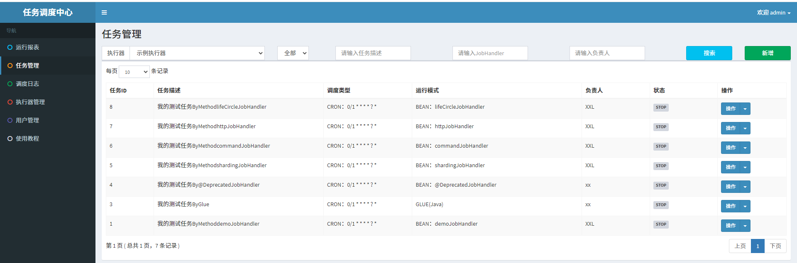

# xxljob-practice
涵盖以下源码调试：
- 基于方法开发的任务代理源码追踪
- 执行器初始化如何创建本地服务器Server
- 执行器初始化向Admin注册源码追踪

测试多种不同类型的执行器：
- 基于glue脚本的简单任务(java、shell、python、php、nodejs、powershell)
- 基于Bean的简单任务
- 基于Bean的分片广播任务
- 基于Bean的命令行任务
- 基于Bean的跨平台Http任务
- 基于Bean的生命周期任务示例：任务初始化与销毁时，支持自定义相关逻辑；

2024.8.31更新
- 基于xxljob的自定义业务组件封装，见module：custom_xxljob_executor_framework